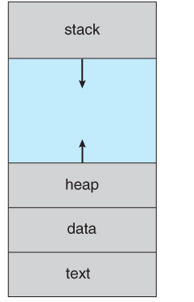
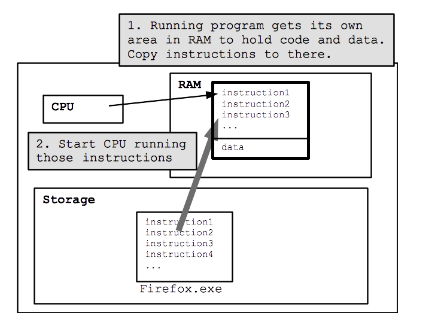

# What Happens When You Run a Computer Program?

## Introduction

How do you run a computer program?

- You may double click the icon.

  Or

- You may run it through a terminal if you happened to be a programmer.

In both cases the Operating System **launches** the program after performing some operations and hand it to the **CPU** to execute it.

Let us look at the journey of a program from sitting in the hard disk to being executed by the **processor**.

## What is a Computer Program?

A computer program is an *executable* version of the source file written by a programmer that contains a *list of instructions*.

A computer program is stored on a **hard disk** until requested to be executed by a user, therefore it is known as a **passive entity**.

The moment you request execution of a computer program, The **Operating System**(OS) comes into play. It is the job of OS to **transform** the passive program into an active entity that can be run by a processor.

## Process: Transformation of a Program

The OS transforms the passive program into an **active entity** by:

- Copying all the instructions into **random-access memory**(RAM), this is known as **loading **the program.

- Allocating computer resources such as:

  - Call Stack: Memory to store function parameters, local variables, and return address.

  - Data Sections: Memory to store global variables.
  - Heap: Memory that is dynamically allocated during run time.
  - The current Activity of the process is represented by the processor's registers' values such as **Program Counter** that stores the address of the next instruction to be executed.

This active form of a computer program is known as a **process**.

> One thing to note is - if you run the same program multiple times, for instance, you open chrome twice you will be creating two different processes from one program. Although both processes will contain the same instructions in **text segment**, their data may be different.

**Diagrammatic Representation of a process in memory: **

## From Memory to CPU

Now our computer program has reached the memory and is waiting for its turn to be executed by CPU.

Once, Its turn arrives, the OS directs the CPU to begin running at the first instruction in the process's text segment in memory.

Then Its CPU's job to execute our program ***instruction by instruction***.

These instructions are in machine code(binary) and are extremely simple like adding two numbers or deciding if a number is equal to zero or not.

> Saying that a CPU can execute 2 billion operations per second means that CPU can execute 2 billion lines of machine code per second.

CPU runs this instruction using a **fetch/execute** cycle:

1. **Fetch** instruction from memory.

2. **Decode** the instruction.

   We need to decode the instruction because each binary sequence in instruction corresponds to a  particular operation depending on the CPU design.

   For Example: In `0 001 0000 0010 0100`  the second sequence of 3 bit `001` may mean to `add` the number at address (referred by the last three sequences of 4 bits) to the value already stored in instructions.

3. **Fetch Operand** if necessary, this means that if there is another value required to operate fetch it from its address in memory, in the previous example our operand address was `0000 0010 0100`.

4. **Execute** - Finally, execute the operation by performing the required logic in the CPU.

## Termination

A program may be terminated because of the following reason:

1. Program Exists Normally.
2. Program Stuck/Infinite Loop - Abnormal Exit.
3. Running out of memory.
4. Memory Access Error - When the program tries to access the memory of another program the OS kills it.

After termination, the OS will reclaim the memory provided to the program to run.

## Takeaways

- A computer program is a passive entity sitting in the hard disk.
- A process is an active entity in RAM that stores the program code and has associated resources.
- CPU runs the instructions in the process text segment line by line.
- The OS keeps everything organized.

---

If you are interested in knowing more about **processes** and how to create and terminate processes programmatically [read this article](./processes.md).

#### References

- Operating System Concepts - Book by Avi Silberschatz
- [Stanford cs101](https://web.stanford.edu/class/cs101/software-1.html)

Hope you found this article helpful and interesting, if you have any feedback please comment down below!

You can connect with me on [Twitter](https://twitter.com/yuvraajsj18) and [LinkedIn](https://linkedin.com/in/yuvraajsj18).

**Thanks for reading**

