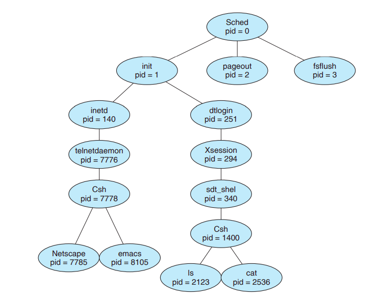
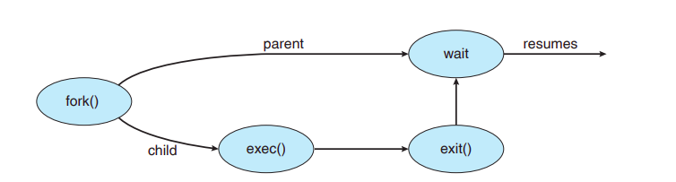
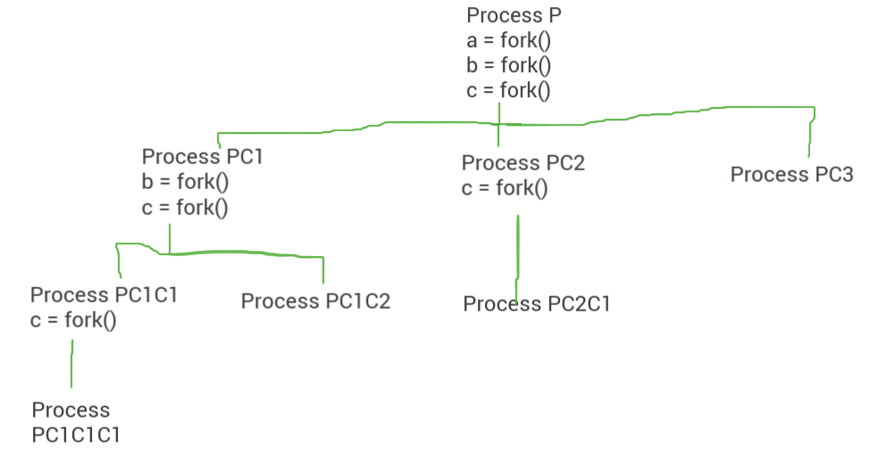

# Processes

## Process Concept

- Process - a program in execution.

- Process is not just *program code*(AKA text section), it also includes:

  - the current activity represented by - 
    - Program Counter Value
    - Content of processor registers
  - Process stack (function parameters, local variables, and return address)
  - Data section(global variables)
  - Heap - Memory that is dynamically allocated during process run time. 

- *Program* is a **passive** entity, whereas a *process* is an **active** entity.

- If user(multiple or single) invoke same copy of the browser, these will be separate processes, despite belonging to the same passive entity.

  - Although the text segment of processes of same program are equivalent, the data, heap, and stack sections are different.

- **Summary**:

  **A program is not a process**; a *program* is a *passive* entity, such as a file containing a list of instructions stored on a disk(executable file), whereas a *process* is an *active* entity, with a *program counter* specifying the next instruction to *execute* and a set of *associated resources*.

  A *program becomes a process* when an executable file is *loaded into memory* either by double clicking or writing a command.

  

  ​															A Process in Memory

## Process State

- As a process executes, it changes **state** -
- *The state of a process is defined in part by the current activity of the process*.
- Each process may be in one of the following states:
  - **New** - The process is being created.
  - **Running** - Instructions are being executed.
    - At one moment of time, only one process can be in running state.
  - **Waiting** - The process is waiting for some event to occur. (such as an I/O completion or reception of a signal).
  - **Ready** - The process is waiting to be assigned to a processor.
  - **Terminated**: The process has finished execution.
- The states name are arbitrary and vary across OS, but the state they represent are found on all systems.
- **Many processes can be in the ready and waiting state.**


## Process Control Block

- Each process is represented in the OS by a Process Control Block(PCB) - also task control block.
- It contains Information associated with a specific process.
- Information Stored:
  - **Process State**: new, ready, running, waiting, terminated.
  - **Program counter**: address of next instruction to be executed.
  - **CPU registers**: Content of all CPU centric registers like accumulators, index register, stack pointers, etc must be saved when interupt occurs, to allow the process to be continued correctly afterward.
  - **CPU Scheduling Information**: This information includes process priority, scheduling queue pointers and other scheduling parameters.
  - **Memory management information**: Information about the memory allocated to the process.
  - **Accounting information**: CPU used, clock time elapsed since start, time limits.
  - **I/O status information**: I/O devices allocated to process, list of open files.


## Process Scheduling

- Maximise CPU use, quickly switch processes onto CPU for time sharing.

- **Process scheduler** selects among available processes for next execution on CPU.

- Maintains **scheduling queues** of processes

  - **Job queue** - set of all processes in the system.

  - **Ready queue** - set of all processes residing in main memory, ready and waiting to execute.

  - **Device queue** - set of all processes waiting for an I/O device. Each device has its own device queue.

  - Process Migrate among the various queues.

  - These queues are generally stored as a *linked list*.

    - A ready queue header contains pointers to the first and final PCB in the list.
    - Each PCB includes a pointer field that points to the next PCB in the ready queue.

    

    - **Queueing Diagram**

      

      A new process is initially put in the ready queue. It waits there until it is selected for execution, or is **dispatched**. Once the process is allocated the CPU and is executing, one of the several events could occur:

      - The process could issue an I/O request and the be placed in an I/O queue.
      - The process could create a new subprocess and wait for the subprocess's termination.
      - The process could be removed forcibly from the CPU as a result of an interrupt, and be put back in the ready queue.
      - On termination, the process is removed from all queues and PCB and resources are deallocated.

### Schedulers

- **Short-term scheduler(or CPU scheduler)** - selects which process should be executed next and allocates CPU.

  - Sometimes the only scheduler in a system.
  - Short term scheduler is invoked **frequently** (milliseconds) => (must be fast)

- **Long-term scheduler(or job scheduler)** - selects which processes should be brought into the ready queue.

  - Long term scheduler is invoked infrequently (seconds, minutes) => (may be slow)
  - The long term scheduler controls the **degree of multiprogramming**(the number of processes in main memory).

- Processes can be described as either:

  - **I/O bound process**: spends more time doing I/O than computation, many short CPU burst.
  - **CPU bound process**: spends more time doing computations, few very long CPU bursts.

- *Long term scheduler strives for good process mix(there should be both I/O bound and CPU bound processes)*

- **Medium Term Scheduler** - It is required when long term scheduler did not bring good mix of CPU and IO bound processes.

  - It decreases the degree of multiprogramming.
  - Removes process from memory, store on disk, bring back in from disk to continue execution: **swapping**.

  

### Context Switch

Switching the CPU to another process requires performing a state save of the current process and a state restore of a different process. This task is known as a **context switch**. 

When a context switch occurs, the kernel saves the context of the old process in its PCB and loads the saved context of the new process scheduled to run.

*Context switch time is pure overhead*: because the system does no useful work while switching.

Speed of context switch varies from machine to machine depending on memory speed, number of registers etc.

The more complex the OS, the more work must be done during context switch.


## Multitasking in Mobile Systems

- Some mobile systems (Example: early version of IOS) allow only one process to run, others suspended.
- Due to screen real estate, user interface limits. IOS provides for a
  - Single **foreground** process - controlled via user interfaces.
  - Multiple **background** processes - in memory, running, but not on the display, and with limits.
  - Limits include single, short task, receiving notification of events, specific long running tasks like audio playback.
- Android runs foreground and background, with fewer limits.
  - Backgroud process uses a **service** to perform tasks.
  - Service can keep running even if background process is suspended.
  - Service has no user interface, less memory use.


## Operation on Processes

Systems must provide a mechanism for process creation and termination.

### Process Creation

- A process can create several new processes, via a **create process system call**, during the course of execution.

  - The creating process is called a **parent** process.
  - The new processes are called the **children** processes.
  - Children processes can create other processes forming a **tree** of processes.

- Processes are identified using a unique identifier integer number known as **process identifier(pid)**.

  - You can get a list of all processes by using `ps -el` command on unix systems.
  - A tree of processes on a typical solaris system - 

  

- A process needs certain resources(CPU time, memory, files, I/O devices) to do its task. When a process creates a subprocess, It will also need such resources.

  **Resource sharing options**:

  - Parent and children share all resources.
  - Children share a subset of parent's resources.
    - Parent have to partition its resources among its children.
    - Prevents any process from overloading the system by creating too many subprocesses.
  - Parent and child share no resources.
    - Subprocess obtains its resources directly from the Operating Systems.

- **Execution Options** when a subprocess is created:

  - Parent and children execute concurrently.
  - Parent waits until children terminates.

- **Address Space Options** for the new process:

  - Child process is a duplicate of parent process. This means they have the same program and data as the parent).
  - Child process has a new program loaded into it.

#### Creating a new process in a UNIX OS

- A new process in UNIX is created using the `fork()` system call.
-  The new process consist of a copy of the **address space** of the original process.
- Both parent and child continue execution after fork() call with one difference - 
  - **The return code for fork() is 0 for the new child process.**
  - **The return code for fork() is the PID of child for the parent process.**
- You can use `exec()` system call after `fork()` to replace process's memory space with a new program.
  - The `exec()` system call loads a binary file into memory(destroying the memory image of the program containing the exec()) and starts its execution.
- A parent can issue a `wait()` system call to move itself off the ready queue until the termination of the child.
  - `wait()` blocks the termination of parent until one of the child terminates.

```c
#include <stdio.h>
#include <sys/types.h>
#include <sys/wait.h>
#include <unistd.h>

int main()
{
    pid_t pid = fork();

    if (pid < 0)    // error check
    {
        fprintf(stderr, "Fork failed\n");
        return 1;
    }

    if (pid == 0)   // child process
    {
        execlp("/mnt/DC84407A844058E2/CS/learn_cs/OS/workspace/practicals/processes/helloworld", "helloworld", NULL);
    }
    else
    {
        wait(NULL);
        printf("Child Complete\n");
    }
    

    return 0;
}
```



- To get the process id of a process or its parent you can use:
  - `getpid()`: returns PID of current process.
  - `getppid()`: returns PID of parent process.
- A process can execute multiple `fork()` call, in that case the number of process will be 2<sup>n</sup>. where n is the number of fork() calls. This count will also include the first parent process.
- The following example shows creation of process when three fork() calls are made.



### Process Termination

- Process executes last statement and then asks the operating system to delete it using `exit()` system call.

  - Returns **status data** from child to parent via `wait()`.
  - Process resources are deallocated by OS.

- Parent may terminate the execution of children processes using the `abort()` system call. Some reasons for doing so:

  - Child has exceeded allocated resources.
  - Task assigned to child is no longer required.
  - The parent is exiting and the OS does not allow a child to continue if its parent terminates.

- Some OS do not allow child to exists if its parent has terminated. If a process terminates, then all its children must also be terminated. This is known as **cascading termination.**

  - Termination is initiated by the OS.

- The parent process may wait for termination of a child process by using the wait() system call. The call returns status information and the PID of the terminated process.

  ```c
  pid_t pid = wait(&status);
  ```

- If no parent is waiting (did not invoke `wait()` ) the process is a **zombie**.

- If parent terminated without invoking `wait()`, process is an **orphan.**

  - orphan processes are adopted by the `init` process.


---

Thanks

