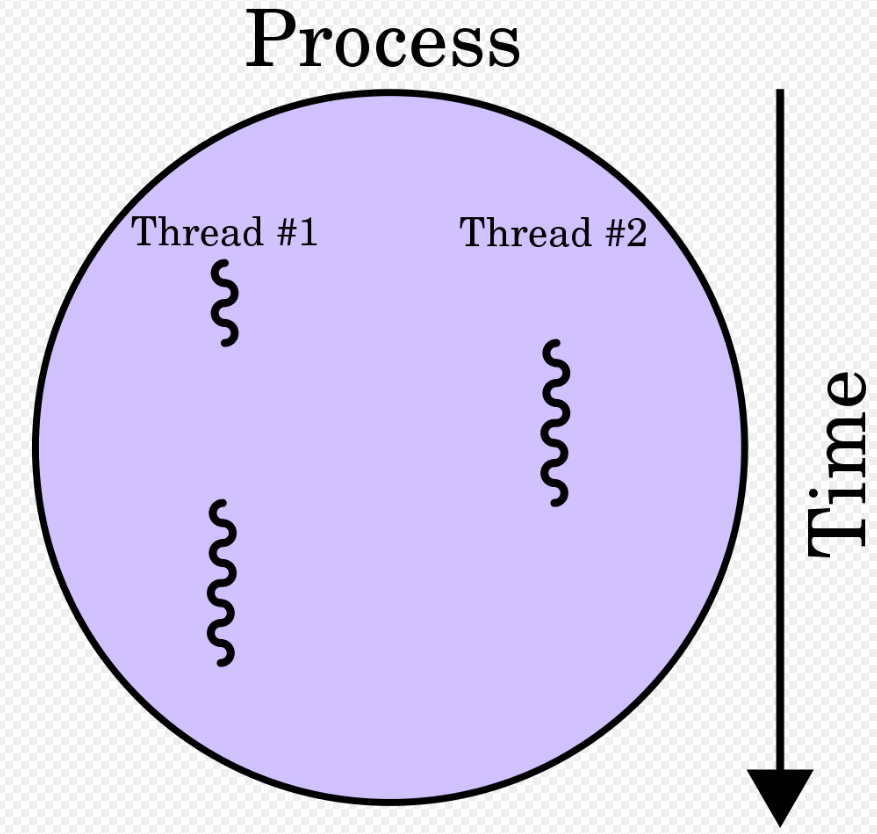
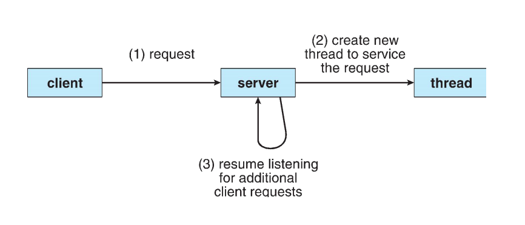
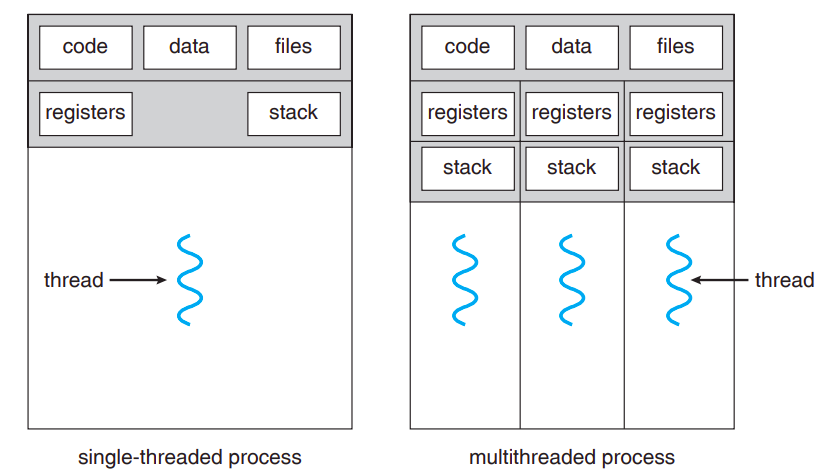
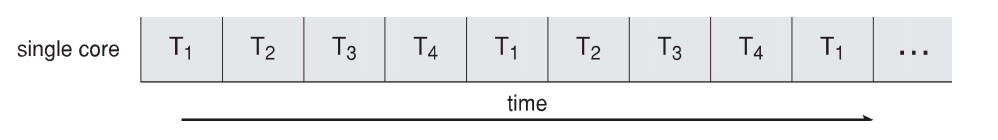
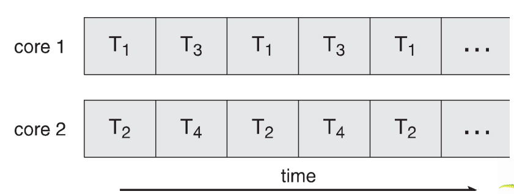
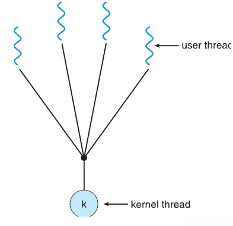
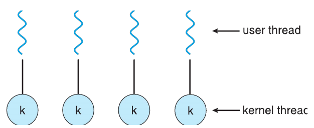
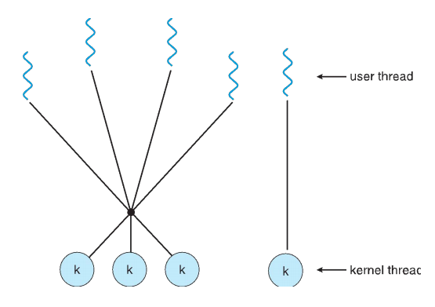

# Threads

**A thread is the fundamental unit of CPU Utilization**

A thread is the smallest sequence of programming instructions that can be managed *independently* by a scheduler.

A thread is a part of a process. All process have atleast one thread and can have multiple in modern operating systems. These threads can execute concurrently and can share resources such as executable code, dynamically allocated and global variables, while different processes do not share these resources.



## Motivation

Why do we need threads?

- Most modern applications are multi-threaded.

  An application today is implemented as a separate process with several threads of control running within these applications.

  Multiple tasks with the applications can be implemented by separate threads: 

  - A web browser can **update display** and **fetch data** using 2 separate threads.

  - A word processor can **spell check**, **display graphics**, and **handle keystrokes** using 3 threads.

- **Process creation is heavy-weight while thread creation is light-weight.**

  Process creation requires the support of OS while threads are created using **thread libraries**. Creating process requires PCB creation for the new process and separate resources are needed. Context switching is also required in case of processes. Thread creation is lightweight as they share all resources.

  **A real world example** - **Web Server**

  A web server may have several clients concurrently accessing it. If the server ran as a traditional single-threaded process, It would be able to service only one client at a time.

  One solution is to create a separate process to service each request. But **Process creation is time consuming and resource intensive** therefore it is better to use one process with multiple threads.

  

- Can simplify code, increase efficiency.

- Kernels are generally multi-threaded.

## Benefits

What are the benefits of multi-threaded programming?

- **Responsiveness** - may allow continued execution if part of process is blocked, especially important for user interfaces.
- **Resource Sharing** - threads share resources of process, easier than shared memory or message passing.
- **Economy** - cheaper than process creation, thread switching lower overhead than context switching.
- **Scalability** - Process can take advantage of multiprocessor architecture, threads can be run in parallel on different processors.



## Multicore programming

- Multiple computing cores can be placed on a single chip, each core appears as a separate processor to the OS.

- Multi-threaded programming provides efficient use of multi-cores and improved concurrency.(See Diagram below)

- Multicore or multiprocessors systems put pressure on programmers to make better use of multiple cores, challenges include:

  - Dividing activities - Applications needs to be divided into separate, concurrent tasks, thus can run in parallel on individual cores.
  - Balance - Separate tasks must perform equal work of equal value. Using a separate core to run a small task may not be worth the cost.
  - Data Splitting - Data must also be divided together with applications to run on separate cores.
  - Data Dependency - data accessed by the tasks must be examined for dependencies between two or more tasks.
  - Testing and Debugging - testing and debugging concurrent programs is difficult than doing same for single threaded programs.

- **Parallelism** implies a system can perform more than one task simultaneously.

- **Concurrency** supports more than one task making progress.

  - Single processor/core, scheduler providing concurrency.

- Types of parallelism

  - **Data Parallelism** - distributes subsets of the same data across multiple cores, same operation on each.
  - **Task Parallelism** - distributes threads across cores, each thread performing unique operations.

- Concurrent Execution on single core system - 

  

- Parallelism on a multi-core system - 

  

## User threads and Kernel Threads

- **User threads** - management done by user level thread library.
- Three primary thread libraries:
  - POSIX **Pthreads**.
  - Windows threads
  - Java threads
- **Kernel threads** - Supported by the kernel.
- Examples - virtually all general purpose operating systems support kernel thread, including:
  - Windows
  - Solaris
  - Linux
  - Tru64 UNIX
  - Mac OS X

## Multi-threading Models

- Defines the relationship between user thread and kernel thread.

- **Many-to-One**

  - Many user-level threads mapped to single kernel thread.
  - One thread blocking causes all to block.
  - Multiple threads may not run in parallel on multicore system because only one may be in kernel at a time.
  - Few systems currently use this model.
  - Examples:
    - Solaris Green Threads
    - GNU Portable Threads

  

- **One-to-One**

  - Each user-level thread maps to kernel thread.
  - *Creating a user level thread creates a kernel thread*
    - the overhead of creating kernel threads can burden the performance of an application.
  - More concurrency than many to one.
  - Number of threads per process sometimes restricted due to overhead.
  - Examples:
    - Windows
    - Linux
    - Solaris 9 and later

  

- **Many-to-Many**

  - Allows many user level thread to be mapped to many kernel threads.
  - Allows the OS to create a sufficient number of kernel threads.
  - Solaris prior to version 9
  - Windows with the ThreadFiber package.

- **Two-Level Model**

  - Similar to Many to Many, except that it allows a user thread to be bound to kernal thread.
  - Examples:
    - IRIX
    - HP-UX
    - Tru64 UNIX
    - Solaris 8 and earlier

  

## Thread Libraries

- Thread library provides programmer with **API** for creating and managing threads.

- Two primary ways of implementing a thread library - 

  -  Library entirely in user space
    - All code and data structures for the library exists in user space.
  - Kernel-level library supported by the OS.
    - Code and data structures for the library exist in kernel space.

- **Pthreads**

  - A thread library.
  - May be provided either as user-level or kernel level.
  - A POSIX standard (IEEE 1003.1c) API for thread creation and synchronization.
  - Specification, not implementation
  - **API** specifies behaviour of the thread library, implementation is up to development of the library.
  - Common in UNIX operating systems (Solaris, Linux, Mac OS X).

- Example:

  ```c
  #include <pthread.h>
  #include <stdlib.h>
  #include <stdio.h>
  
  int sum;    // data shared between threads
  void *runner(void *param); // thread call this function
  
  int main(int argc, char *argv[])
  {
      if (argc != 2)
      {
          fprintf(stderr, "usage: ./thread0 <integer value>\n");
          return -1;
      }
  
      if (atoi(argv[1]) < 0)
      {
          fprintf(stderr, "%d must be >= 0\n", atoi(argv[1]));
          return -1;
      }
  
      pthread_t tid;  // thread identifier
      pthread_attr_t attr; // set of thread attribute
  
      // get the default attributes
      pthread_attr_init(&attr);
  
      // create the thread
      pthread_create(&tid, &attr, runner, argv[1]);
      
      // wait for the thread to exit
      pthread_join(tid, NULL);
  
      printf("sum = %d\n", sum);
  
      return 0;
  }
  
  // The thread will begin control in this function
  void *runner(void *param)
  {
      int upper = atoi(param);
      sum = 0;
  
      for (int i = 1; i <= upper; i++)
          sum += i;
  
      pthread_exit(0);
  }
  
  /* ./thread0 5
  sum = 15
  */
  ```

  


